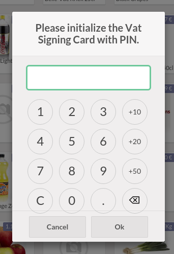

=======
Belgium
=======

.. _belgium/introduction:

Fiscal certification: POS restaurant
====================================

In Belgium, the owner of a business that offers cooking services (such as a restaurant, a
food-truck, etc.) and has a turnover (excluding VAT, drinks and take-away food) that exceeds 25 000
euros a year, is required, by law, to issue their cash register receipts using a
government-certified **Cash Register System**.

This government-certified system entails the use of a **certified POS system**, along with a device
called a **Fiscal Data Module** (or **black box**) and a **VAT Signing Card** (delivered after
registration by the Service Public Federal Finances).

A certified POS system
----------------------

To ensure full compliance with the law, the Odoo POS system is certified for `Odoo 9 (Odoo Online)
<https://www.systemedecaisseenregistreuse.be/systemes-certifies>`_, and Odoo 13 to Odoo 15 (**Odoo
Online** and **odoo.sh**).

In order to get certified, the POS application had to adhere to strict government guidelines. As a
result, a certified Odoo POS system works a bit differently than a non-certified Odoo PoS.

- You cannot:

  - Make a refund.
  - Set up and use the **global discounts** feature (the `pos_discount` module is blacklisted and
    cannot be activated).
  - Set up and use the **loyalty programs** feature (the `pos_loyalty` module is blacklisted and
    cannot be activated).
  - Reprint receipts (the `pos_reprint` module is blacklisted and cannot be activated).
  - Modify prices in order lines.
  - Modify or delete order lines in POS orders.
  - Sell products without a valid VAT number.
  - Use a POS that is not connected to an IoT box.

- The :doc:`cash rounding <../../sales/point_of_sale/shop/cash_rounding>` feature must be
  activated and set to a :guilabel:`Rounding Precision` of `0,05` and a :guilabel:`Rounding Method`
  set as :guilabel:`Half-Up`.
- Taxes must be set as included in price. :menuselection:`Point of Sale --> Configuration -->
  Settings --> Taxes section --> External link --> Advanced Options` and enable :guilabel:`Included
  in Price`.
- At the start of a POS session, users must click :guilabel:`Work in` to clock in. Doing so allows
  the registration of POS orders. If users are not clocked in, they cannot make POS orders.
  Likewise, they must click :guilabel:`Work Out` to clock out at the end of the session.

.. warning::
   Odoo :ref:`On-premise <belgium/on-premise>` is *not* certified.

The Fiscal Data Module
----------------------

The :abbr:`FDM (Fiscal Data Module)`, or `black box
<https://www.systemedecaisseenregistreuse.be/systemes-certifies>`_ is a government-certified device
that works together with the Point of Sale application and saves all your POS orders information.
Concretely, a **Hash** (:dfn:`unique code`) is generated for each POS order and added to its
receipt. This allows the government to verify that all revenue is declared.

.. note::
   - We recommend the use of the Cleancash SC-B.
   - Ensure your black box is approved by the Belgian Government. To verify your black box's
     conformity, go to `www.boîtenoire.be <https://www.xn--botenoire-r5a.be/>`_.

.. seealso::
   More information concerning the Fiscal Data Module can be found on `the official website
   <https://www.systemedecaisseenregistreuse.be/>`_.

Configuration
~~~~~~~~~~~~~

Before setting up your database to work with a FDM, ensure you have the following hardware:

- a registered :ref:`black box <belgium/blackbox>` (go to
  `www.boîtenoire.be <https://www.xn--botenoire-r5a.be/>`_ to order yours and to the `FPS website
  <https://finances.belgium.be/E-services/registratiemodule_gks/registratiemodule_gerigstreerd_kassasysteem>`_
  to register it);
- a serial null modem cable per FDM (`example
  <https://www.startech.com/Cables/Serial-Parallel-PS-2/DB9-DB25/10-ft-Cross-Wired-Serial-Null-Modem-Cable-DB9-FM~SCNM9FM>`_);
- a serial-to-USB adapter per FDM (`example
  <https://trendnet.com/products/proddetail.asp?prod=265_TU-S9>`_); and
- An :ref:`IoT Box <belgium/iotbox>` (one IoT box per black box).

.. _belgium/blackbox:

Black box
*********

As a pre-requisite, activate the **black box module**. To do so, go to the :guilabel:`Apps`
application, remove the :guilabel:`Apps` filter and search for the ``Belgian Registered Cash
Register`` module (technical name: ``pos_blackbox_be``) and click :guilabel:`Activate`.

.. image:: belgium/be-modules.png
   :align: center
   :alt: black box modules for belgian fiscal certification

Once the module is activated, update your company info with your VAT number. To set it up, go to
:menuselection:`Settings --> Companies --> Update Info`, and fill in the :guilabel:`VAT` field.
Then, add the national registration number to every employee that will be using the POS. To do so,
go to :guilabel:`Employee`, select the employee, go to :menuselection:`HR settings tab -->
Attendance` and fill in the :guilabel:`INSZ or BIS number` field.

.. tip::
   You can fill in the field for yourself by clicking on your avatar, then :menuselection:`My
   Profile --> Preference tab` and filling in the :guilabel:`INSZ or BIS number` field.

The first time you open the Point of  Sale and attempt to do a transaction, you are asked to input
the PIN that you received with your :ref:`VAT signing card <belgium/introduction>`.

.. warning::
   The black box needs to be directly configured in the production database. Using it in a test
   environment would save wrong data in the black box itself.

.. _belgium/iotbox:

IoT Box
*******

In order to use a Fiscal Data Module, you need a registered IoT Box. To register your IoT box, you
must contact us via our `contact form <https://www.odoo.com/help>`_, and provide us with:

- your VAT number;
- the name, address, and legal form of your company; and
- the Mac address of your IoT

Once your IoT box is certified, :doc:`connect <../../productivity/iot/config/connect>` it to
your database. To verify that the Fiscal Data Module is recognized by the IoT Box, go to the IoT
homepage and scroll down the :guilabel:`IOT Device` section, which should automatically display the
FDM.

.. image:: belgium/iotbox-fdm-status.png
   :align: center
   :alt: Hardware status page on a registered IoT Box

Then, add the IoT to your POS. To do so, go to :menuselection:`Point of Sale --> Configuration -->
Point of Sale`, select your POS, scroll down to the :guilabel:`Connected Device` section, and enable
:guilabel:`IoT Box`. Lastly, add the FMD in the :guilabel:`Fiscal Data Module` field.

.. note::
   To be able to use a FDM, you must at least connect a :guilabel:`Receipt Printer`.

.. _belgium/on-premise:

On-premise
----------

The usage of the module from the source or a modified version **cannot** be certified. For
on-premise users, we also support the Fiscal Data Module in such installations. The main restriction
is that this requires an obfuscated version of the ``pos_blackbox_be`` module we provide on-request
for Enterprise customers.
